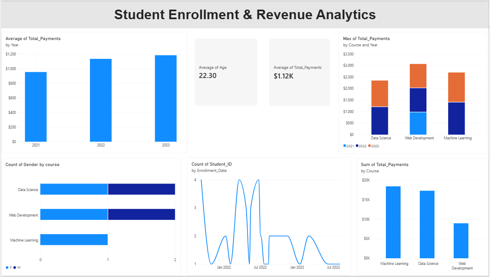

#  Student Enrollment & Revenue Analytics
​A data cleaning project showcasing raw vs cleaned student enrollment and payment datasets using Excel and Power Query.

## Tools & Technologies

- **Microsoft Excel & Power Query:** Data cleaning, transformation, and preparation of raw datasets.
- **Power BI:** Importing cleaned datasets, data modeling, and interactive dashboard development.
- Raw Data
2. Data Cleaning & Transformation
Excel + Power Query
3. Cleaned Dataset
4. Data Analysis & Visualization
Power BI
5. Interactive Dashboard
Enrollment, payment, revenue, and demographic insights

##  Data Cleaning Steps

Data cleaning and transformation were performed using Excel and Power Query, including:

- **Missing Values:** Identified and handled missing (null) values in key columns.
- **Duplicate Records:** Checked for and removed duplicate student records.
- **Empty Rows & Columns:** Removed unnecessary blank rows and columns to improve dataset structure.
- **Data Transformation:** Standardized text formats, data types, and data structures using Power Query.

## Dashboard Preview
 
